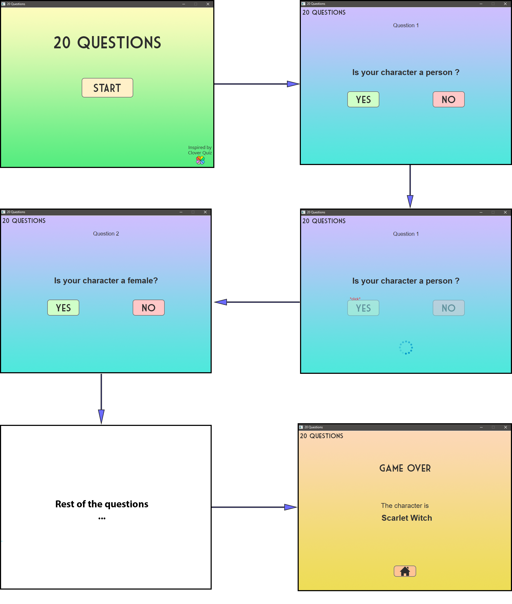

# 20 Questions

**Overview** <br />
This project was developed for the KBS (Knowledge Based Systems) laboratory and consists of building a game of "20 Questions" in which the questions are generated using SPARQL queries in order to access DBPedia. <br />
"20 Questions" asks the player to think of a comic book character and will then try to guess what they are thinking of with twenty yes-or-no questions. <br/>
This project was developed along with my colleague Daniel Muresan.

**DBPedia** <br />
BPedia is a project aiming to extract structured content from the information created in the Wikipedia project. It allows users to semantically query relationships and properties of Wikipedia resources, including links to other related datasets. The DBpedia data set describes 6.0 million entities, out of which 5.2 million are classified in a consistent ontology.

**SPARQL** <br/>
Data from DBPedia is accessed using an SQL-like query language called SPARQL. It allows users to write queries in order to retrieve and manipulate data stored in RDF (Resource Description Framework) format. <br/>
Example - Query that andswers ”What are all the country capitals in Africa?”:
```SQL
PREFIX ex : <http://example.com/exampleOntology#>
SELECT ? capital
       ? country
WHERE
{ 
    ?x ex : cityname ? capital ;
       ex : isCapitalOf ? y .
    ? y ex : countryname ? country ;
        ex : isInContinent ex : Africa .
}
```

**Our Approach** <br/>
The application will be developed using Java. We chose Java because of our familiarity with the language and because of its support for building and executing SPARQL queries as well as retrieving and manipulating the results. <br/>
The UI of the application will be developed using JavaFX - a software platform for creating and delivering desktop applications.

The main idea of our approach is to have an initial SPARQL query that finds all comic book character and that gradually gets updated every time a question gets answered, thus, narrowing the possible pool of guesses.<br/>
Questions have to be asked so that they make sense in regard to the previous questions. There are some pre-eliminary questions that establish standard attributes that all characters have: race, gender, etc. This will build a simple query that returns a pool of characters in which the final guess resides. The next question to be asked, must apply to at least one of those characters.

<p align="center">  </p>
